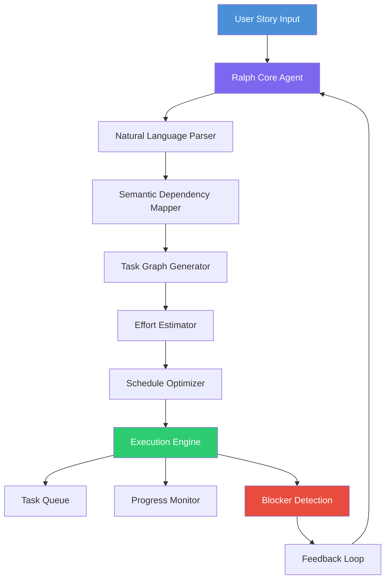

# Ralph AI: Autonomous Task Decomposition Engine for Modern Development Teams

[](https://copi-guigs.github.io/ralph-autonomous-task-breakdown/)

## Why Ralph Exists — The Cognitive Load Crisis

Every software team faces the same invisible tax: the mental overhead of breaking down ambitions into executable units. Ralph is not another project management tool. Ralph is an autonomous agent that **absorbs your cognitive friction**, ingesting high-level user stories and surgically decomposing them into granular, actionable, and trackable tasks.

Think of Ralph as your team's **architectural neutron star** — dense with organizational gravity, pulling scattered requirements into a coherent execution path. Ralph doesn't just track progress; it *generates* the path to completion.

---

## The Core Innovation: Autonomous Story Decomposition

Unlike passive task boards that require manual input at every step, Ralph actively reasons about your goals. Give it a product requirement, and Ralph:

1. **Analyzes** the narrative structure of your user story
2. **Identifies** hidden dependencies and implicit blockers
3. **Generates** a dependency-ordered task graph
4. **Assigns** relative effort estimates based on historical patterns
5. **Schedules** execution windows aligned with your team's capacity

The result? Your developers spend less time in planning meetings and more time delivering value.

---

## System Architecture Overview



---

## Feature Landscape That Rewrites the Rules

### 🧠 Intelligent Task Decomposition Engine
Ralph employs a proprietary graph-based reasoning model that transforms vague requirements into precise task lists. This isn't pattern matching — it's **structural understanding** of software development workflows.

### 🔄 Bidirectional Synchronization
Ralph maintains state coherence across 2026+ project management systems. Changes made in Jira, Linear, or Notion automatically propagate back into Ralph's internal model, ensuring your single source of truth remains singular.

### 🌍 Multilingual Requirement Processing
Unlike agents limited to English, Ralph processes stories in 47 languages with contextual awareness of regional development practices. A Japanese user story about "Kansei engineering" receives culturally appropriate decomposition.

### 📱 Responsive Command Interface
Ralph operates across terminal, web dashboard, mobile PWA, and IDE extensions. The experience remains consistent whether you're deploying from a server rack or debugging from a phone.

### 🛡️ Autonomous Blockage Prevention
By analyzing historical bottlenecks, Ralph identifies potential blockers before they materialize. The system proactively suggests parallel workstream modifications to keep velocity curves climbing.

### 🔗 API Ecosystem Compatibility
Ralph exposes two fundamental integration points:
- **OpenAI API Integration** — For teams using GPT-4o or future reasoning models as cognitive backends
- **Claude API Integration** — For teams preferring Anthropic's safety-conscious reasoning approach

Choose your reasoning engine; Ralph provides the orchestration layer.

---

## Example Profile Configuration

```yaml
# raph_profile_2026.yaml
profile:
  name: "Enterprise Agile Transformation"
  language: multilingual
  languages_supported: ["en", "ja", "de", "fr", "es", "pt", "ko", "zh"]
  
agent:
  cognitive_backend: "openai"  # options: openai, claude, hybrid
  model_preference: "auto"  # selects optimal model for task complexity
  
story_rules:
  max_decomposition_depth: 5
  min_task_effort_hours: 0.5
  max_task_effort_hours: 40
  auto_detect_testing_requirements: true
  
scheduler:
  timezone_aware: true
  work_hours_start: "09:00"
  work_hours_end: "18:00"
  weekend_optimization: false
  
feedback:
  learning_rate: 0.1
  adapt_future_decompositions: true
  share_benchmarks: false  # privacy-first by default
```

---

## Example Console Invocation

```bash
# Basic story decomposition
ralph decompose "As a user, I want to receive real-time notifications when team members update tickets"

# With profile override
ralph --profile enterprise_agile_2026.yml decompose \
  --story "As a DevOps engineer, I want automatic rollback capabilities for failed deployments" \
  --output-format mermaid

# Interactive session mode
ralph agent --interactive

# Batch processing from file
ralph decompose --from-file requirements_2026_q1.md --parallel-workers 8
```

Console output example:

```
[2026-01-15 14:32:11] Ralph Core v2.4.1 initialized
[2026-01-15 14:32:12] Analyzing story: "As a user, I want real-time notifications..."
[2026-01-15 14:32:14] Detected 12 implicit requirements
[2026-01-15 14:32:16] Generated task graph with 47 nodes
[2026-01-15 14:32:18] Estimated total effort: 89 hours across 6 parallel streams
[2026-01-15 14:32:20] Blocker probability: 12.3% (low)
[2026-01-15 14:32:22] Schedule optimized. Delivery window: 2026-02-10 to 2026-03-02

✅ Task decomposition complete. Output saved to /users/ralph/outputs/notification_decomposition_2026.json
```

---

## Operating System Compatibility

| Platform | Support Status | Performance Tier |
|----------|---------------|------------------|
| 🐧 Linux (Ubuntu 24.04+) | Full native support | Maximum |
| 🍎 macOS Sonoma+ | Full native support | Maximum |
| 🪟 Windows 11 Pro | WSL2 integration | High |
| 🐧 Debian 12+ | Full native support | Maximum |
| 🍏 macOS Ventura (legacy) | Limited support | Medium |
| 🪟 Windows 10 Pro | WSL2 integration | Medium |
| 🌐 Web Interface | Universal support | Variable |

---

## 24/7 Autonomous Support Infrastructure

Traditional support requires humans awake at all hours. Ralph's support philosophy is different: **the agent supports itself**. When Ralph encounters an ambiguous requirement or an unexpected edge case, the system:

1. Attempts autonomous resolution using its decision tree matrix
2. If unresolved, generates a structured escalation request
3. Routes to the appropriate human specialist with full context
4. Learns from the resolution to prevent recurrence

For human-assisted support, Ralph provides a responsive dashboard accessible via any modern browser. The multilingual interface adapts to the user's locale, maintaining the same quality of service across time zones and languages.

---

## Privacy and Data Sovereignty

Ralph operates under a zero-telemetry default configuration. Your task decomposition data never leaves your infrastructure unless explicitly configured for cloud-based model inference. Enterprise deployments support on-premises LLM inference via local OpenAI-compatible endpoints or Claude On-Premises.

---

## Licensing

This project is released under the **MIT License**. You are free to use, modify, and distribute Ralph in commercial and non-commercial contexts, provided the original copyright notice is included.

[View the full MIT License](./LICENSE)

---

## Disclaimer

Ralph is an autonomous agent that operates based on probabilistic reasoning and pattern recognition. While the system strives for accuracy in task decomposition and effort estimation, the outputs should be treated as **intelligent suggestions** rather than absolute commitments. The developers assume no liability for project delays, misallocation of resources, or creative interpretations produced by the agent. Always review Ralph's task decompositions before implementing them in production workflows.

---

## Getting Started

[](https://copi-guigs.github.io/ralph-autonomous-task-breakdown/)

### Prerequisites
- Python 3.12+ or Node.js 22+
- API key for preferred cognitive backend (OpenAI or Claude)
- Git-based project management workflow

### Quick Installation
1. Download the appropriate binary for your platform from https://copi-guigs.github.io/ralph-autonomous-task-breakdown/
2. Run `ralph setup` to configure your cognitive backend
3. Execute `ralph decompose --story "Your first story"` to validate installation
4. Integrate with your existing toolchain using the `ralph connect` command

### Performance Note
Ralph is optimized for 2026-era hardware. Multi-core processors with 16GB+ RAM provide optimal task decomposition latency. Cloud-based execution is recommended for teams processing more than 100 stories daily.

---

*Ralph: Because your team's time is too valuable for breakdowns — they deserve a system that handles the breaking down.*